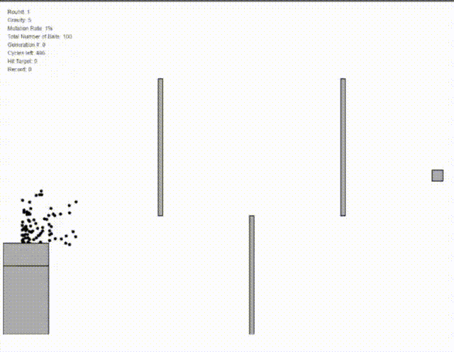
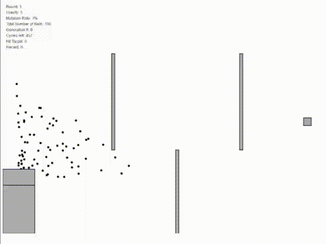
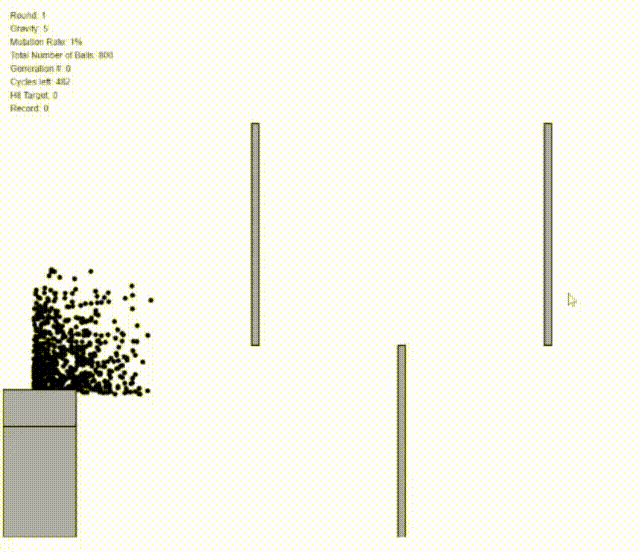

# Projectile Motion with Genetic Algorithm

## Reference

Credit to [Daniel Shiffman](https://natureofcode.com/book/chapter-9-the-evolution-of-code/). This project refers to his great work!

## Introduction

This program simulates how genetic algorithm is used to increase the hit rate for Projectile Motion

## Variables

We can customize the initial data of these variables to test the algorithm under different conditions

> Number of Balls 
> Gravity 
> Mutation Rate(percentage)

## Examples

### Succeed

### Fail(Case 1: Bad Luck)

### Fail(Case 2: Impossible Position)

## How To Execute

Run "index.html"
